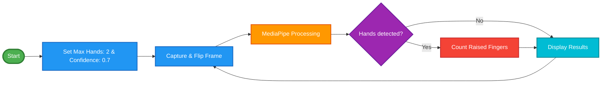

## $${\color{blue}Fingers \space Counter} $$

A real-time finger counting application using Python, OpenCV, and MediaPipe that detects and counts fingers from both hands simultaneously through your webcam.

<p align="center">
  
</p>


### *Features*    
* $${\color{lightgreen}Dual \space Hand \space Detection \space :} $$  Counts fingers on both hands at the same time
* $${\color{lightgreen}Real-time  \space Processing \space :} $$  Instant finger counting with live video feed
*  $${\color{lightgreen}Visual \space Feedback \space :} $$ Displays hand landmarks and connections
*  $${\color{lightgreen}Mirror \space Mode \space :} $$  Flipped camera view for intuitive interaction

### *Demo*
The application detects up to 2 hands and counts the number of raised fingers in real-time, displaying the total count on screen. 
### *Requirements*      
```diff
- Python 3.7+ : (The Best version for Use OpenCV and MediaPipe is Python 3.11)
- Opencv : (Version 4.12.0.88)
- MediaPipe : (0.10.14)
```
## $${\color{blue}Installation } $$ 
#### Clone this repository:
```bash
git clone https://github.com/youness372/Fingers-Counter-Python.git
cd Fingers-Counter-Python
```
#### Install the required dependencies:
```bash
pip install opencv-python mediapipe
```
#### Usage
  * Run the application:   
```bash
python finger_counter.py
```
#### Controls:   
```diff
- Press "q" to quit the application
```

### $${\color{blue}How-it-Works } $$ 

* $${\color{lightgreen}Hand \space Detection \space :} $$ Uses MediaPipe's hand tracking solution to detect up to 2 hands
* $${\color{lightgreen}Landmark \space Identification \space :} $$  Extracts 21 landmark points for each detected hand
* $${\color{lightgreen}Finger \space Counting \space Logic \space :} $$ :
  
  * $${\color{lightgreen}Thumb \space :} $$  Detected based on horizontal position relative to other thumb landmarks
  * $${\color{lightgreen}Other \space Fingers \space :} $$ Counted as raised if the fingertip is above the middle joint
* $${\color{lightgreen}Display \space } $$  Shows the total count of raised fingers from both hands
  
### $${\color{blue}Technical \space Details } $$ 

* $${\color{lightgreen} Detection \space Confidence :} $$ Set to 0.7 for reliable hand detection
* $${\color{lightgreen}Camera \space Feed \space :} $$  Mirrored horizontally for natural interaction
* $${\color{lightgreen}Finger \space IDs \space :} $$  Uses MediaPipe landmark indices (4: thumb, 8: index, 12: middle, 16: ring, 20: pinky)


### $${\color{blue}Code \space Structure } $$ 


